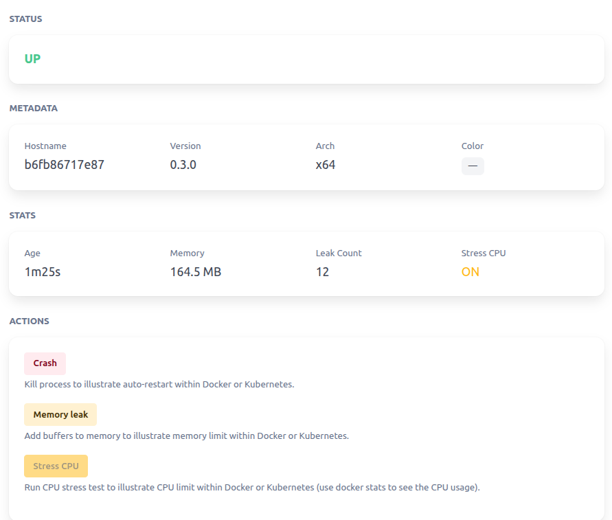

# mborne/debug

A buggy API to illustrate Docker and Kubernetes features :



## Parameters

| Name          | Description                                                                                                                             | Default    |
| ------------- | --------------------------------------------------------------------------------------------------------------------------------------- | ---------- |
| `DEBUG_PORT`  | Listening port                                                                                                                          | `3000`     |
| `DEBUG_COLOR` | A color to illustrates env vars handling and blue/green deployments                                                                     | `null`     |
| `LOG_FORMAT`  | Log format to illustrate JSON parsing ("simple" or "json")                                                                              | `"simple"` |
| `LOG_LEVEL`   | [Log level](https://github.com/winstonjs/winston?tab=readme-ov-file#using-logging-levels) ("debug", "verbose", "info", "warn", "error") | `"info"`   |

## Usage

### Usage with docker

See [docker-compose.yml](docker-compose.yml) :

```bash
# start on http://localhost:3000
docker compose up -d --build

# simulate crash 
curl -X POST http://localhost:3000/api/bug/crash

# simulate memory leak
while true; do curl -X POST -sS http://localhost:3000/api/bug/memory-leak ; echo; sleep 1; done
```

### Kubernetes usage

```bash
kubectl -k manifests
# work in progress (trying to avoid Ingress)...
```

### Local usage

```bash
# install stress-ng
sudo apt-get update
sudo apt-get install -y stress-ng

# install dependencies
npm install
# start on http://localhost:3000
npm run start
```

## License

[MIT](LICENSE)
